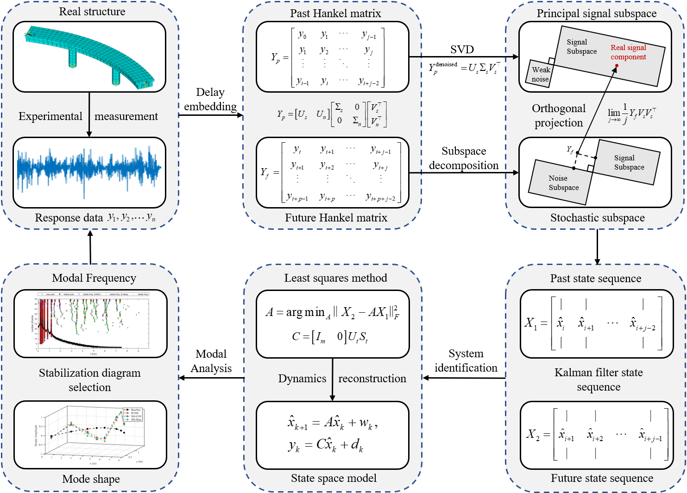

# Principal Component Stochastic Subspace Identification for Output-Only Modal Analysis

**Code for the Preprint Paper**  
**Title**: *Principal Component Stochastic Subspace Identification for Output-Only Modal Analysis*  
📌 This repository provides the official MATLAB implementation of the **PCSSI algorithm** proposed in our preprint.  
📎 Paper: [https://doi.org/10.48550/arXiv.2504.00317](https://doi.org/10.48550/arXiv.2504.00317)  
🔗 Personal Research Homepage: [https://github.com/Chen861368/Personal-Research-Path](https://github.com/Chen861368/Personal-Research-Path)

---

## 📄 Paper Abstract

Stochastic Subspace Identification (SSI) is widely used in modal analysis of engineering structures, known for its numerical stability and high accuracy in modal parameter identification. Traditional SSI methods are generally classified into two categories: Data-Driven (SSI-Data) and Covariance-Driven (SSI-Cov), which have been considered to stem from different theoretical foundations and computational principles.

In this study, we establish a **unified framework** that incorporates instrumental variable analysis, demonstrating that SSI-Cov and SSI-Data converge to the same solution under the condition of infinite observations.

Based on this framework, we propose a novel modal identification approach — **Principal Component Stochastic Subspace Identification (PCSSI)**. This method applies Principal Component Analysis (PCA) to extract the dominant signal subspace and project the observed data onto it, thereby enhancing identification stability and significantly reducing computational cost.

Using 5000 Monte Carlo simulations and experimental data from a scaled bridge model, we show that PCSSI consistently outperforms traditional SSI approaches in terms of numerical stability, noise robustness, and practical applicability under limited data and high-noise conditions.

---

## 📁 Repository Overview

This repository provides a clean MATLAB implementation of the proposed PCSSI method for output-only modal parameter identification in multi-degree-of-freedom (MDOF) systems. All code and data directly support the results presented in the preprint.

  

### 📂 File Descriptions

| File              | Description |
|-------------------|-------------|
| `BridgeData.mat`  | Displacement response data of the Lysefjord Bridge (from open source) |
| `Example.mlx`     | Reproducible example script for testing the PCSSI algorithm |
| `PCSSI.m`         | Core function implementing Principal Component Stochastic Subspace Identification |
| `plotStabDiag.m`  | Function for plotting stabilization diagrams |
| `SSI_modal.png`   | Graphical illustration of the PCSSI algorithm workflow |
| `README.md`       | Project description and usage guide |

---

## ▶️ How to Run

1. **Open MATLAB** and navigate to the repository directory.
2. Open and run `Example.mlx`:
   - Load the displacement data
   - Add non-stationary Gaussian noise
   - Perform PCSSI-based modal identification
   - Plot displacement signals, PSDs, and the stabilization diagram

> ⚠️ The noise ratio is deliberately set to 0.5 to evaluate the denoising capability of PCSSI.

---

## 📌 Highlights of the PCSSI Paper

- ✅ Establishes a theoretical equivalence between SSI-Cov and SSI-Data through a unified framework.
- 🔍 Utilizes **Principal Component Analysis** to enhance noise robustness.
- ⚙️ Achieves **lower computational cost** and **greater numerical stability**, especially under noisy and short-duration data.
- 📊 Outperforms traditional SSI methods in **5000 Monte Carlo simulations** and **scaled experimental bridge tests**.

---

## 💻 Requirements

- MATLAB R2020b or newer
- Signal Processing Toolbox (for functions like `pwelch`, etc.)

---

## 🙏 Acknowledgements

- The clustering and stabilization diagram algorithm is adapted from the open-source work of **E. Cheynet** (version updated on 06/12/2019).
- We gratefully acknowledge his contributions to the open-source structural dynamics community.

---

## 📝 License

This project is licensed under the [MIT License](LICENSE).
